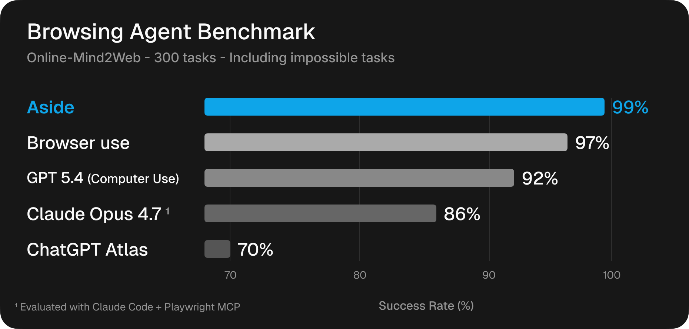

# Online-Mind2Web — Aside Browser Agent

Evaluates the [Aside](https://asidehq.com) browser agent on the
[Online-Mind2Web](https://github.com/OSU-NLP-Group/Online-Mind2Web) benchmark —
300 real-world web navigation tasks across 136 websites.

## Results



| Model | Tasks | Passed | Failed | Impossible | Pass Rate | Pass Rate (excl. impossible) |
|-------|-------|--------|--------|------------|-----------|------------------------------|
| `gpt-5.5` (openai-codex) | 300 | 297 | 2 | 1 | **99.0%** | **99.3%** |

Detailed results for each task are in [`results/`](./results/).

### Tasks not completed

3 tasks were not completed — 1 is impossible due to current site inventory,
and 2 were genuine failures:

| Task | Verdict | Reason |
|------|---------|--------|
| Send a Dillard's "Merry Christmas" eGift Card | impossible | Site no longer offers a "Merry Christmas" eGift card design; Dec 25 delivery also disabled |
| Add a used Apple Mac Studio M4 Max 16-core to cart | fail | No M4 Max 16-core Mac Studio in stock; not purchasable online |
| Search for 33-49" QLED 240Hz gaming monitor $1000-$2000 | fail | Failed |

Excluding the 1 impossible task: **297/299 = 99.3%**.

### By difficulty

| Level | Passed | Total | Pass Rate |
|-------|--------|-------|-----------|
| easy | 80 | 80 | 100% |
| medium | 142 | 143 | 99.3% |
| hard | 75 | 77 | 97.4% |

## Configuration

| Setting | Value |
|---------|-------|
| Model | `gpt-5.5` |
| Provider | `openai-codex` |
| Thinking | `high` |
| Fast mode | `true` |
| Concurrency | 3–6 |
| Timeout | 900s per task |
| Grader | `gpt-5.4` (automated LLM grading) |

## Output format

Results are written to `results/{task_id}/`:

```
results/
  {task_id}/
    result.json       # Task result + grader verdict
    trajectory.txt    # Agent-readable message/tool-call history
    trajectory/       # Step screenshots (webp)
```

**`result.json` fields:**

| Field | Description |
|-------|-------------|
| `task_id` | Benchmark task identifier |
| `level` | Difficulty: `easy`, `medium`, or `hard` |
| `task` | Natural-language instruction |
| `website` | Target website URL |
| `durationMs` | Total execution time in milliseconds |
| `outcome` | Raw outcome before grading |
| `graderVerdict` | `pass`, `fail`, or `impossible` |
| `graderReasoning` | Grader's step-by-step reasoning |
| `graderDurationMs` | Grading call duration |
| `provider` | Model provider used |
| `tabCount` | Number of browser tabs opened during the task |
| `messageCount` | Total agent messages exchanged |
| `final_result_response` | Agent's final output |
| `action_history` | High-level action log |
| `thoughts` | Agent reasoning trace |
| `screenshots` | Screenshot references |
| `artifacts` | Additional artifacts collected |

## Citation

If you use Online-Mind2Web in your work, please cite the original paper:

```bibtex
@article{xue2025illusionprogressassessingcurrent,
  title={An Illusion of Progress? Assessing the Current State of Web Agents},
  author={Tianci Xue and Weijian Qi and Tianneng Shi and Chan Hee Song and
          Boyu Gou and Dawn Song and Huan Sun and Yu Su},
  year={2025},
  eprint={2504.01382},
  archivePrefix={arXiv},
  primaryClass={cs.AI},
}
```
